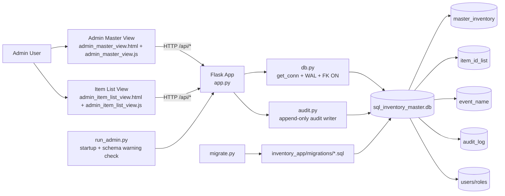
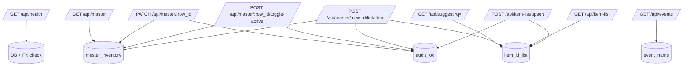
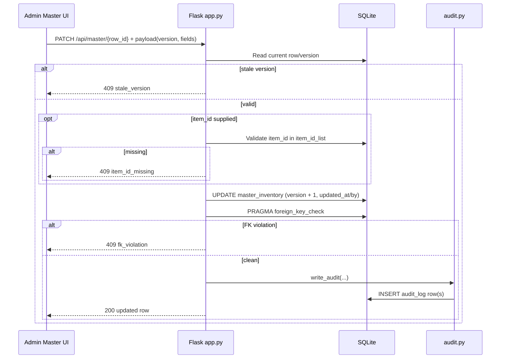
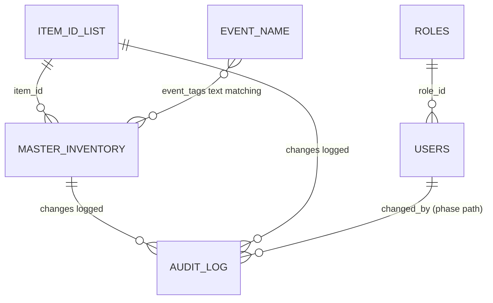

# System Map (Backend ↔ Satellites)

Use this file as your **always-on visual reference**.

In VS Code: open this file, then **Markdown: Open Preview**.

---

## 1) Big Picture (how the system is wired)

---

## 2) Backend API Surface (mental map)

---

## 3) Critical Interaction: Save Master Row

---

## 4) Data Backbone (core relationships)

---

## 5) Satellites and Their Purpose

- **Satellite A:** Master view UI
  - Focus: edit inventory rows, link/unlink items, active/inactive state.
- **Satellite B:** Item list UI
  - Focus: curate canonical `item_id` + `item_name` dictionary.
- **Core backend:** Flask + SQLite integrity rules + audit trail.

Think of it as:

- Satellites = operator screens
- Core = API + DB rules
- Spine = migrations + schema checks + audit log

---

## 6) “Where do I look when…” quick guide

- API behavior: [app.py](app.py)
- DB connection + pragmas: [db.py](db.py)
- Audit writes: [audit.py](audit.py)
- Startup / entrypoint: [run_admin.py](run_admin.py)
- Schema migration runner: [migrate.py](migrate.py)
- Master UI behavior: [static/admin_master_view.js](static/admin_master_view.js)
- Item List UI behavior: [static/admin_item_list_view.js](static/admin_item_list_view.js)

